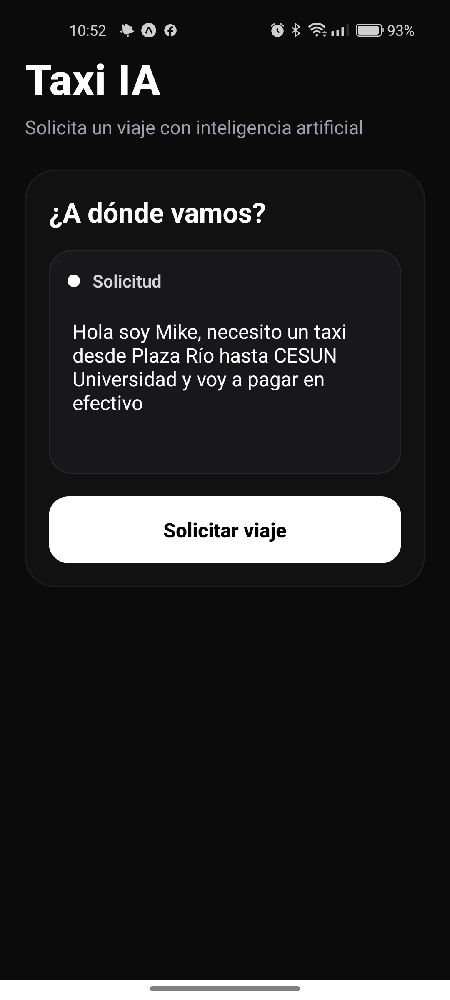
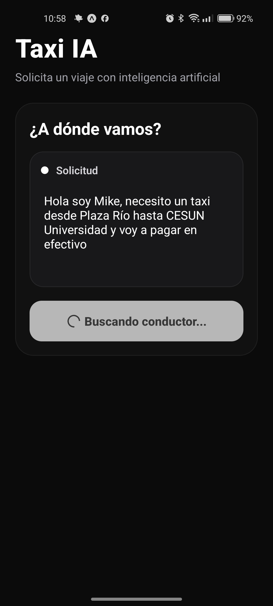
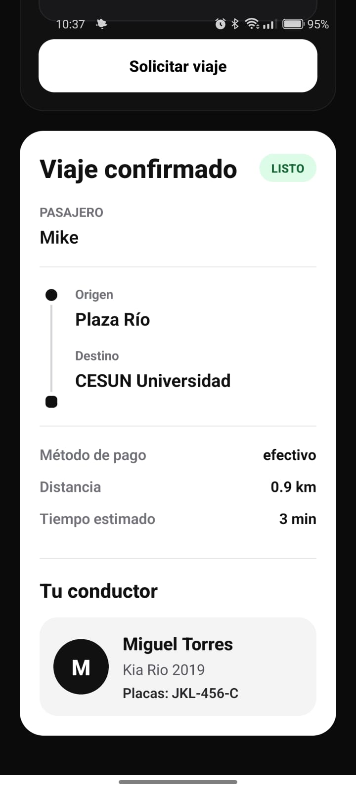
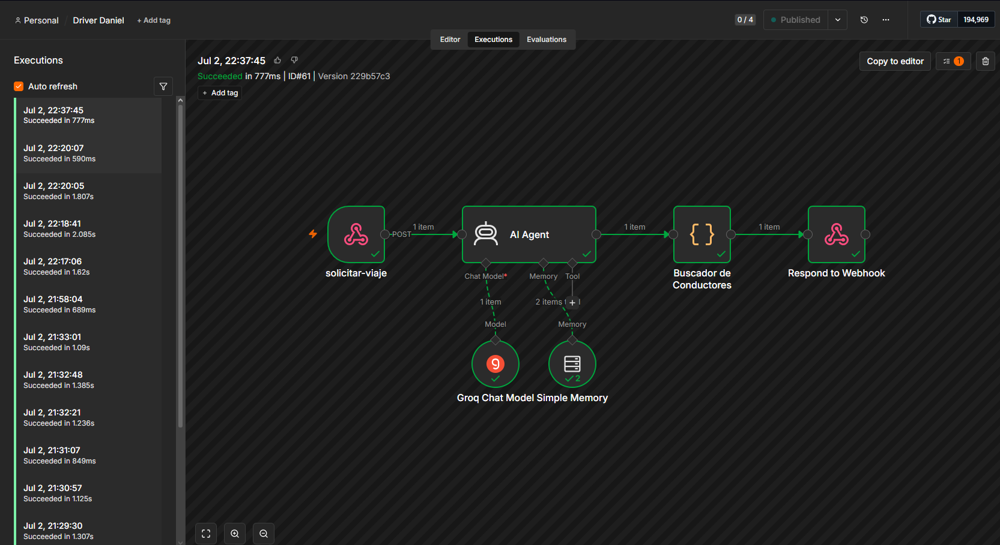
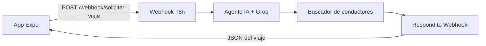

# Taxi IA — Expo + n8n

Aplicación móvil académica para solicitar un taxi mediante lenguaje natural. La app envía la solicitud a un workflow local de n8n, un agente de IA extrae los datos del viaje y un nodo de código asigna al conductor disponible más cercano.

**Repositorio público:** [github.com/CelizD/N8NDocker-](https://github.com/CelizD/N8NDocker-)

## Demostración

| Solicitud | Procesamiento | Viaje confirmado |
| --- | --- | --- |
|  |  |  |

### Ejecución del workflow



## Arquitectura



El workflow incluye:

- **Webhook `solicitar-viaje`:** recibe el texto y el identificador de sesión.
- **AI Agent:** extrae pasajero, origen, destino y método de pago.
- **Groq Chat Model:** procesa la solicitud en lenguaje natural.
- **Simple Memory:** conserva el contexto de cada sesión.
- **Buscador de Conductores:** compara conductores y selecciona el más cercano.
- **Respond to Webhook:** devuelve el resultado estructurado a la app.

## Tecnologías

- Expo SDK 54 y React Native 0.81
- TypeScript y Expo Router
- n8n 2.27.4 sobre Docker
- Groq como proveedor del modelo de lenguaje
- PowerShell para los ejemplos de configuración local

## Estructura del proyecto

```text
N8NDocker/
├── app-mobile/                 # Aplicación Expo
│   ├── app/                    # Pantallas y navegación
│   ├── assets/                 # Recursos gráficos
│   ├── .env.example            # Ejemplo de URL para la app
│   └── package.json
├── docs/screenshots/           # Evidencias visuales
├── docker-compose.yml          # Servicio local de n8n
├── workflow-viajes-n8n.json    # Workflow exportado
├── .env.example                # Ejemplo de URL para Docker
└── README.md
```

## Requisitos

- Docker Desktop
- Node.js 20.19 o superior
- npm
- Expo Go instalado en el teléfono
- Una credencial de Groq configurada en n8n
- Computadora y teléfono conectados a la misma red Wi-Fi

## Instalación local

### 1. Clonar el repositorio

```powershell
git clone https://github.com/CelizD/N8NDocker-.git
cd N8NDocker-
```

### 2. Configurar n8n

Copia el archivo de ejemplo:

```powershell
Copy-Item .env.example .env
```

Edita `.env` con la IP Wi-Fi de la computadora:

```env
N8N_WEBHOOK_URL=http://192.168.1.74:5678/
```

Inicia el contenedor:

```powershell
docker compose up -d
```

Abre [http://localhost:5678](http://localhost:5678) en el navegador.

Si el volumen de n8n es nuevo:

1. Importa `workflow-viajes-n8n.json`.
2. Selecciona o crea la credencial de Groq en **Groq Chat Model**.
3. Confirma que el campo **Path** del Webhook contenga únicamente `solicitar-viaje`.
4. Guarda y publica el workflow **Driver Daniel**.

### 3. Configurar la aplicación

```powershell
cd app-mobile
Copy-Item .env.example .env.local
```

Edita `app-mobile/.env.local` usando la misma IP:

```env
EXPO_PUBLIC_N8N_WEBHOOK_URL=http://192.168.1.74:5678/webhook/solicitar-viaje
```

Instala las dependencias e inicia Expo:

```powershell
npm install
npx expo start --lan
```

Escanea el código QR con Expo Go.

> `localhost` no funciona desde un teléfono físico porque apunta al propio teléfono. Debe utilizarse la IP Wi-Fi de la computadora.

## Contrato del webhook

### Petición

```http
POST /webhook/solicitar-viaje
Content-Type: application/json
```

```json
{
  "input": "Hola soy Mike, necesito un taxi desde Plaza Río hasta CESUN Universidad y voy a pagar en efectivo",
  "sessionId": "usuario_demo_001"
}
```

### Respuesta exitosa

```json
{
  "success": true,
  "mensaje": "Viaje despachado correctamente",
  "pasajero": "Mike",
  "origen": "Plaza Río",
  "destino": "CESUN Universidad",
  "tipoPago": "efectivo",
  "conductorAsignado": {
    "nombre": "Miguel Torres",
    "auto": "Kia Rio 2019",
    "placas": "JKL-456-C"
  },
  "distanciaKm": 0.9,
  "tiempoEstimadoLlegadaMin": 3
}
```

## Probar el webhook desde PowerShell

```powershell
$body = @{
  input = "Hola soy Mike, necesito un taxi desde Plaza Río hasta CESUN Universidad y voy a pagar en efectivo"
  sessionId = "prueba_powershell"
} | ConvertTo-Json

Invoke-RestMethod `
  -Uri "http://localhost:5678/webhook/solicitar-viaje" `
  -Method Post `
  -ContentType "application/json" `
  -Body $body
```

## Verificación del código

Desde `app-mobile`:

```powershell
npm run lint
npm run typecheck
```

## Solución de problemas

### `The requested webhook ... is not registered`

- Confirma que el workflow esté publicado.
- En el nodo Webhook, deja solamente `solicitar-viaje` en **Path**.
- Usa `/webhook/solicitar-viaje`, no el UUID interno del nodo.

### `Configuración requerida`

Comprueba que exista `app-mobile/.env.local` y reinicia Expo:

```powershell
npx expo start --clear --lan
```

### El teléfono no se conecta

- Verifica que ambos dispositivos estén en la misma red Wi-Fi.
- Confirma la IP con `ipconfig`.
- Permite el puerto `5678` en el firewall si la red lo bloquea.
- Comprueba el estado con `docker compose ps`.

## Seguridad

- `node_modules`, `.expo`, `.env` y `.env.local` no deben subirse al repositorio.
- Las variables `EXPO_PUBLIC_*` quedan visibles en la aplicación compilada; no deben contener claves privadas.
- Las credenciales de Groq permanecen almacenadas dentro de n8n y no en el código móvil.

## Conclusión

El proyecto demuestra la integración entre una interfaz móvil y un pipeline de automatización local. Expo administra la experiencia de solicitud y los estados de carga, mientras n8n coordina el webhook, el procesamiento con IA, la selección del conductor y la respuesta estructurada que se renderiza dinámicamente en el teléfono.
